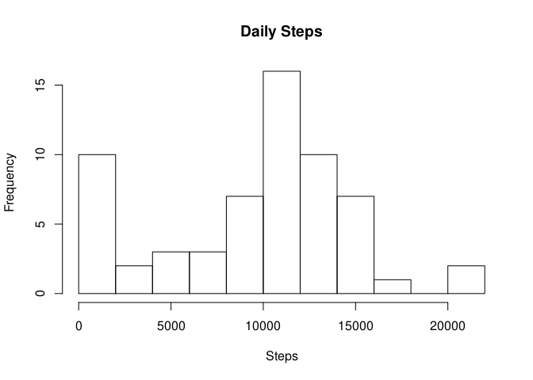
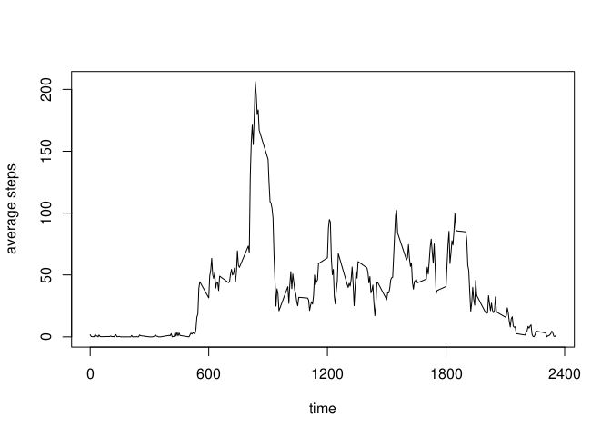
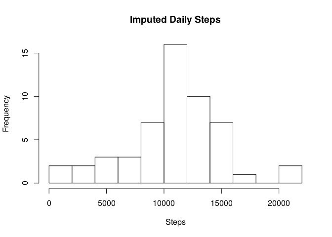
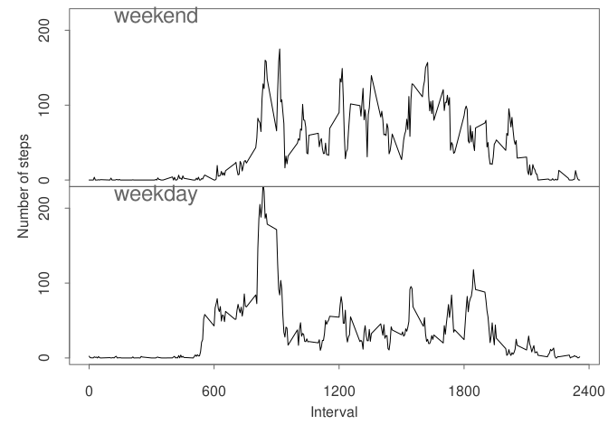

```r
library(knitr)
opts_chunk$set(tidy=FALSE, echo=TRUE, result="asis")
```

## Loading and preprocessing the data

```r
library(tidyverse)
```

```
## ─ Attaching packages ──────────────────── tidyverse 1.3.0 ─
```

```
## ✓ ggplot2 3.3.2     ✓ purrr   0.3.4
## ✓ tibble  3.0.4     ✓ dplyr   1.0.2
## ✓ tidyr   1.1.2     ✓ stringr 1.4.0
## ✓ readr   1.4.0     ✓ forcats 0.5.0
```

```
## ─ Conflicts ───────────────────── tidyverse_conflicts() ─
## x dplyr::filter() masks stats::filter()
## x dplyr::lag()    masks stats::lag()
```

```r
act <- read_csv("activity.zip")
```

```
## 
## ─ Column specification ────────────────────────────
## cols(
##   steps = col_double(),
##   date = col_date(format = ""),
##   interval = col_double()
## )
```
## What is mean total number of steps taken per day?

```r
daySteps <- act %>% group_by(date) %>% summarize(steps=sum(steps, na.rm=T ))
```

```
## `summarise()` ungrouping output (override with `.groups` argument)
```

```r
hist(daySteps$steps, breaks=12, main="Daily Steps", xlab="Steps")
```

<!-- -->

Mean and median of daily steps are


```r
sprintf("%6.0f", mean(daySteps$steps))  
```

```
## [1] "  9354"
```

```r
sprintf("%6.0f", median(daySteps$steps))
```

```
## [1] " 10395"
```
respectively.

## What is the average daily activity pattern?

```r
timeSteps <- act %>% group_by(interval) %>% summarize(aveSteps=mean(steps, na.rm=T ))
```

```
## `summarise()` ungrouping output (override with `.groups` argument)
```

```r
plot(timeSteps, type="l", xlab="time", ylab="average steps")
```

<!-- -->

Maximum average of a day is in 

```r
sprintf("%4.0f", timeSteps[which.max(timeSteps$aveSteps),1])
```

```
## [1] " 835"
```

## Imputing missing values

There are 2304 missing values in steps.


```r
sum(is.na(act$steps))
```

```
## [1] 2304
```

```r
mean(is.na(act$steps))
```

```
## [1] 0.1311475
```


```r
dayAve <- act %>% group_by(date) %>% summarize(ave=mean(steps, na.rm=T ))
```

```
## `summarise()` ungrouping output (override with `.groups` argument)
```

```r
# if steps are NA then mean(steps, na.rm=T) returns nan, fill it with 0
x <- dayAve$ave %>% as.numeric %>% is.nan()
dayAve[x,2] <- 0.0

acti <- tibble(act)  # duplicate  
for (i in 1:nrow(acti)) {
    if (is.na(acti[i,"steps"])) {
        idx <- match(acti[i,"date"], dayAve$date)
        acti[i,"steps"] <- dayAve[idx, "ave"]
    }
}
dayStepsi <- acti %>% group_by(date) %>% summarize(steps=sum(steps, na.rm=T ))
```

```
## `summarise()` ungrouping output (override with `.groups` argument)
```

```r
hist(dayStepsi$steps, breaks=12, main="Imputed Daily Steps", xlab="Steps")
```

<!-- -->

Mean and median of daily steps after imputing are


```r
sprintf("%6.0f", mean(dayStepsi$steps))  
```

```
## [1] "  9354"
```

```r
sprintf("%6.0f", median(dayStepsi$steps))
```

```
## [1] " 10395"
```
respectively.

There seems to be no difference before and after imputing.   
The effect of imputing is not large.

## Are there differences in activity patterns between weekdays and weekends?


```r
Sys.setlocale("LC_TIME", "en_US.UTF-8")
```

```
## [1] "en_US.UTF-8"
```

```r
wkd <- function(dt) {
    ifelse(weekdays(dt) %in% c("Saturday","Sunday"), "weekend", "weekday")
}
actW <- acti %>% mutate(workday=wkd(date))
timeStepsW  <- actW %>%
    filter(workday == "weekday") %>%
    group_by(interval) %>%
    summarize(aveSteps=mean(steps, na.rm=T ))
```

```
## `summarise()` ungrouping output (override with `.groups` argument)
```

```r
timeStepsWe  <- actW %>%
    filter(workday == "weekend") %>%
    group_by(interval) %>%
    summarize(aveSteps=mean(steps, na.rm=T ))
```

```
## `summarise()` ungrouping output (override with `.groups` argument)
```

```r
dat <- c(timeStepsWe, timeStepsW)
ttl <- c("weekend", "weekday")
par(mfrow=c(2, 1), mar=c(0,0,0,0), oma=c(4,4,0.5,0.5))    
par(tcl=-0.25)
for (i in 1:2) {
    if (i==1) { 
        plot(timeStepsWe, type="l", axes=FALSE, ylim=c(0,220))
    } else {
        plot(timeStepsW,  type="l", axes=FALSE, ylim=c(0,220))
    }       
    mtext(ttl[i], side = 3, line = -1, adj = 0.1, cex = 1.5, col = "grey40")
    axis(2, col = "grey40", col.axis="grey20", gap.axis=0.5 ,at = seq(0,220,100))
    if (i==2) { 
        axis(1, col = "grey40", col.axis="grey20" ,cex=0.7, at = seq(0,2500,600))
    }       
    box(col = "grey40")
}
mtext("Interval", side = 1, outer = TRUE, cex = 1.0, line = 2.2, col = "grey20")   
mtext("Number of steps", side = 2, outer = TRUE, cex = 1.0, line = 2.2, col = "grey20")
```

<!-- -->

```r
dev.copy(png, filename="figure/PA1_template.png", width=480, height=480)
```

```
## png 
##   3
```

```r
dev.off()
```

```
## png 
##   2
```
## Note of imputing with average

I chose a very simple imputing methods of substituting NA with a average value of a day, and the mean and median did not change.
This note is how it occurred.

In this data, all NA's are all over a day.


```r
act %>% filter(is.na(steps)) %>% nrow
```

```
## [1] 2304
```

```r
act %>% filter(is.na(steps)) %>% select(date) %>% unique()
```

```
## # A tibble: 8 x 1
##   date      
##   <date>    
## 1 2012-10-01
## 2 2012-10-08
## 3 2012-11-01
## 4 2012-11-04
## 5 2012-11-09
## 6 2012-11-10
## 7 2012-11-14
## 8 2012-11-30
```

```r
288*8
```

```
## [1] 2304
```

as number of intervals of a day is (60/5) * 24 = 288 

they are converted to 0 through
 

```r
daySteps <- act %>% group_by(date) %>% summarize(steps=sum(steps, na.rm=T ))
```

```
## `summarise()` ungrouping output (override with `.groups` argument)
```

```r
daySteps[1:10,]
```

```
## # A tibble: 10 x 2
##    date       steps
##    <date>     <dbl>
##  1 2012-10-01     0
##  2 2012-10-02   126
##  3 2012-10-03 11352
##  4 2012-10-04 12116
##  5 2012-10-05 13294
##  6 2012-10-06 15420
##  7 2012-10-07 11015
##  8 2012-10-08     0
##  9 2012-10-09 12811
## 10 2012-10-10  9900
```

When there is NA in steps in a day, steps are all NA throughout a day.
When imputing, these values comes out to be a nan, so I substited it with 0.
The bottom line is doing the same path for both.

There may be a argument to substitute nan to 0, But there might not a good one to choose.
As number of NA days are not very much


```r
daySteps %>% summarize(mean(steps==0) ) ## 0.131
```

```
## # A tibble: 1 x 1
##   `mean(steps == 0)`
##                <dbl>
## 1              0.131
```
just excluding those NA days might be a better idea.
